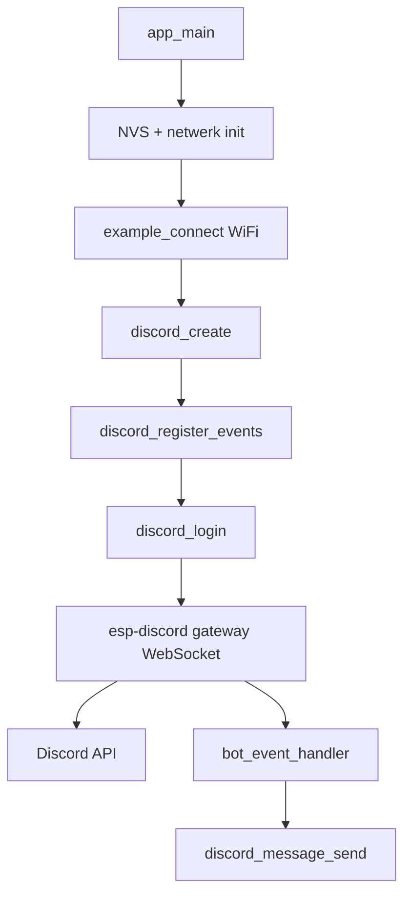

# Interne documentatie

Technische uitleg van hoe dit project werkt. Bedoeld als naslag voor verdere ontwikkeling.

## Overzicht



De applicatie draait op FreeRTOS. esp-discord start een eigen `discord_task` die de WebSocket gateway beheert. Events worden via het ESP event systeem naar `bot_event_handler` gestuurd.

## Bestanden en verantwoordelijkheden

| Bestand | Rol |
|---------|-----|
| `main/discord_bot.c` | Applicatie entrypoint en event handling |
| `main/secrets.h` | Auto-generated Discord token (via `sync_env.py`) |
| `main/idf_component.yml` | Component dependencies |
| `components/esp-discord/` | Discord library (WebSocket gateway + REST API) |
| `scripts/sync_env.py` | `.env` naar `secrets.h` en `sdkconfig` |
| `sdkconfig` | WiFi credentials en build config (lokaal, niet in git) |
| `sdkconfig.defaults` | Standaard project instellingen |

## `app_main()` flow

Locatie: `main/discord_bot.c`

```c
void app_main(void)
```

Stappen in volgorde:

1. **`nvs_flash_init()`**  
   Initialiseert Non-Volatile Storage voor WiFi credentials en andere persistente data.

2. **`esp_netif_init()`**  
   Initialiseert het ESP netwerk interface subsystem.

3. **`esp_event_loop_create_default()`**  
   Maakt de default event loop aan (nodig voor WiFi en Discord events).

4. **`example_connect()`**  
   Verbindt met WiFi via `protocol_examples_common`. Credentials komen uit `sdkconfig` (`CONFIG_EXAMPLE_WIFI_SSID` / `CONFIG_EXAMPLE_WIFI_PASSWORD`), gezet door `sync_env.py`.

5. **`discord_create(&cfg)`**  
   Maakt een Discord client aan met:
   - `intents`: `DISCORD_INTENT_GUILD_MESSAGES | DISCORD_INTENT_MESSAGE_CONTENT`
   - `token`: `DISCORD_BOT_TOKEN` uit `secrets.h`

6. **`discord_register_events()`**  
   Registreert `bot_event_handler` voor alle Discord events (`DISCORD_EVENT_ANY`).

7. **`discord_login(bot)`**  
   Start de gateway verbinding. Blokkeert niet; de discord task draait op de achtergrond.

## `bot_event_handler()` events

Locatie: `main/discord_bot.c`

```c
static void bot_event_handler(void *handler_arg, esp_event_base_t base,
                              int32_t event_id, void *event_data)
```

| Event | Wat gebeurt er |
|-------|----------------|
| `DISCORD_EVENT_CONNECTED` | Logt bot username en discriminator uit de session |
| `DISCORD_EVENT_MESSAGE_RECEIVED` | Logt bericht, echo't terug (tenzij van een bot) |
| `DISCORD_EVENT_MESSAGE_UPDATED` | Logt bewerkte berichten |
| `DISCORD_EVENT_MESSAGE_DELETED` | Logt verwijderde bericht IDs |
| `DISCORD_EVENT_DISCONNECTED` | Waarschuwing dat de bot is uitgelogd |

### Echo logica (`DISCORD_EVENT_MESSAGE_RECEIVED`)

1. Parse `discord_message_t` uit `event_data->ptr`
2. Skip als `msg->author->bot == true`
3. Bouw reply string met `estr_cat()`:
   ```
   Hey <username> you wrote `<content>`
   ```
4. Maak `discord_message_t echo` met `content` en `channel_id`
5. Roep `discord_message_send(bot, &echo, &sent_msg)` aan
6. `free(echo_content)` en `discord_message_free(sent_msg)` bij succes

## Belangrijke esp-discord API's

Gebruikt in dit project. Volledige API: `components/esp-discord/include/`.

### Client lifecycle

| Functie | Beschrijving |
|---------|--------------|
| `discord_create(const discord_config_t *config)` | Maakt client aan, init gateway en event loop |
| `discord_register_events(handle, event, handler, arg)` | Registreert callback voor events |
| `discord_login(handle)` | Start gateway verbinding (async task) |
| `discord_logout(handle)` | Verbreekt verbinding |
| `discord_destroy(handle)` | Ruimt client op |

### Berichten

| Functie | Beschrijving |
|---------|--------------|
| `discord_message_send(handle, msg, &out_msg)` | Stuurt bericht naar `msg->channel_id` via REST API |
| `discord_message_free(msg)` | Geeft gealloceerd message object vrij |

### Config struct

```c
typedef struct {
    char *token;
    int intents;
    size_t gateway_buffer_size;
    size_t api_buffer_size;
    size_t api_timeout_ms;
    uint8_t queue_size;
    size_t task_stack_size;
    uint8_t task_priority;
} discord_config_t;
```

Alleen `token` en `intents` worden in dit project expliciet gezet. Overige velden gebruiken library defaults.

### Intents (dit project)

```c
DISCORD_INTENT_GUILD_MESSAGES    // Berichten in server kanalen
DISCORD_INTENT_MESSAGE_CONTENT   // Inhoud van berichten lezen (privileged)
```

Zonder `MESSAGE_CONTENT` is `msg->content` leeg.

## Secrets flow

```
.env
  ├── DISCORD_TOKEN  →  scripts/sync_env.py  →  main/secrets.h  →  DISCORD_BOT_TOKEN
  ├── WIFI_SSID      →  scripts/sync_env.py  →  sdkconfig       →  CONFIG_EXAMPLE_WIFI_SSID
  └── WIFI_PASSWORD  →  scripts/sync_env.py  →  sdkconfig       →  CONFIG_EXAMPLE_WIFI_PASSWORD
```

`main/secrets.h` en `sdkconfig` staan in `.gitignore`. Commit nooit `.env`.

## Component dependencies

`main/idf_component.yml`:

| Dependency | Bron | Doel |
|------------|------|------|
| `esp-discord` | `../components/esp-discord` | Discord gateway + API |
| `protocol_examples_common` | ESP-IDF examples | WiFi connect helper |
| `espressif/cjson` | Component registry | JSON parsing (IDF 6 vervanging voor `json`) |

## ESP-IDF 6 aanpassingen

esp-discord is officieel voor IDF 5.3+. Voor IDF 6.0.2 zijn deze patches nodig:

1. **`components/esp-discord/idf_component.yml`**  
   `idf: "^5.3"` gewijzigd naar `idf: ">=5.3"`

2. **`components/esp-discord/CMakeLists.txt`**  
   `REQUIRES json` gewijzigd naar `REQUIRES cjson` (json component bestaat niet meer in IDF 6)

3. **TLS certificaten**  
   `certgen.sh` genereert `gateway.pem` en `api.pem` voor Discord hosts. Eenmalig via `scripts/generate_discord_certs.ps1`.

## Build configuratie (`sdkconfig.defaults`)

| Setting | Waarde | Reden |
|---------|--------|-------|
| `CONFIG_EXAMPLE_CONNECT_WIFI` | `y` | WiFi als netwerk interface |
| `CONFIG_MBEDTLS_CERTIFICATE_BUNDLE` | `y` | HTTPS/WSS certificaat validatie |
| `CONFIG_ESP_MAIN_TASK_STACK_SIZE` | `8192` | Meer stack voor Discord + WiFi |

## Interne esp-discord architectuur (kort)

```
discord_login()
  └── discord_task (FreeRTOS)
        ├── dcgw_*     WebSocket gateway (gateway.discord.gg)
        ├── dcapi_*    REST API calls (discord.com/api)
        └── esp_event_post → bot_event_handler()
```

Gateway payloads worden in een queue geplaatst en verwerkt door `dcgw_handle_payload()`. REST calls (zoals `discord_message_send`) gaan via `dcapi_*`.

## Uitbreiden

### Nieuw commando toevoegen

In `DISCORD_EVENT_MESSAGE_RECEIVED`, voeg logica toe vóór of na de echo:

```c
if (strcmp(msg->content, "!ping") == 0) {
    discord_message_t reply = {
        .content = "pong",
        .channel_id = msg->channel_id,
    };
    discord_message_send(bot, &reply, NULL);
    break;
}
```

### Andere events gebruiken

Registreer specifieke events in plaats van `DISCORD_EVENT_ANY`:

```c
discord_register_events(bot, DISCORD_EVENT_MESSAGE_RECEIVED, bot_event_handler, NULL);
discord_register_events(bot, DISCORD_EVENT_CONNECTED, bot_event_handler, NULL);
```

Beschikbare events staan in `components/esp-discord/include/discord.h`.

### Meer intents

Voeg toe aan `discord_config_t.intents` en zet de bijbehorende intent aan in het Discord Developer Portal.

## Debugging tips

- Tag voor logging: `discord_bot` (filter in monitor: geen filter nodig, alles is `I` level)
- Bij auth failures: gateway sluit met `DISCORD_CLOSEOP_AUTHENTICATION_FAILED`
- Serial monitor baudrate: standaard 115200
- Heap problemen: verhoog `CONFIG_ESP_MAIN_TASK_STACK_SIZE` of `discord_config_t.task_stack_size`
